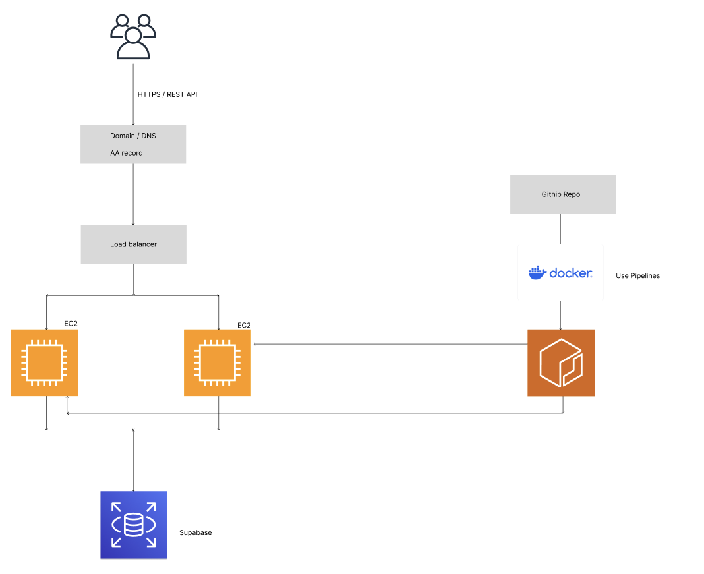

# Food Safety Data Service

## Overview

This project is a backend service for storing and retrieving bacterial test results from food production facilities. It is designed for food safety teams who need reliable historical data to make decisions and prevent contamination issues.

## Personas (Who this is built for)

### 1. Quality Managers

- Need to make sure every production line is tested regularly
- Want to quickly see which lines are missing recent tests

How this system helps:

- Test results are stored with timestamps
- Data can be filtered by facility and production line
- It is easy to check the latest test date per line

### 2. Operators

- Need to log test results fast
- Do not want complicated forms or extra steps

How this system helps:

- Simple REST API to create test results
- Facility and production line names are created automatically if missing
- Basic validation only (CFU >= 0, required fields)

### 3. Food Safety Leads

- Need to analyze historical data
- Want to spot trends and possible outbreaks early

How this system helps:

- Historical results can be retrieved by date range
- CFU counts are stored as numbers for easy analysis

## Tech Stack

- **Language:** TypeScript (Node.js)
- **Framework:** Express
- **Database:** PostgreSQL (via Supabase)
- **ORM:** Sequelize
- **Deployment:** Docker + AWS EC2

## Why PostgreSQL?

I chose PostgreSQL because:

- Data is relational (Facility → Production Line → Test Results)
- Strong consistency is important for food safety data
- Easy to run locally and in the cloud

## Data Model (Simplified)

- Facility
  - id (UUID)
  - name

- ProductionLine
  - id (UUID)
  - name
  - facilityId

- TestResult
  - id (UUID)
  - productionLineId
  - cfuCount
  - location
  - testedAt

## API Endpoints

### Create a test result

```
POST /api/test-results
```

Request body:

```
{
  "facilityName": "Factory A",
  "productionLineName": "Mixer Line 1",
  "cfuCount": 23,
  "location": "Malmo",
  "testedAt": "2026-02-27T13:57:00Z"
}
```

What happens:

- Facility is created if it does not exist
- Production line is created if it does not exist
- Test result is stored with timestamp

### Get historical test results

```
GET /api/test-results
```

Optional query params:

- `facilityId`
- `productionLineId`
- `from` (date)
- `to` (date)
- `limit`
- `offset`

Example:

```
GET /api/test-results?from=2026-02-01&to=2026-02-28
```

## How to Run the Application (Without Docker)

### Prerequisites

Make sure you have the following installed:

- Node.js (v20 or later)
- npm
- A PostgreSQL database (Supabase or local)

### Environment Variables

Create a `.env` file in the project root:

```
DB_USER=xxxx
DB_PASS=xxxx
DB_HOST=xxx
DB_PORT=xxx
DB_NAME=xxx
```

### Run the app

```
npm install
npx ts-node src/index.ts
```

## Filtering Strategy (Simple & Clear)

- Database filtering is used for:
  - Date ranges
  - Production line IDs
  - Facility IDs

- Frontend filtering:
  - Text search (facility name, production line name)
  - Quick experimentation without extra API calls

This keeps the backend efficient and the frontend simple.

## Deployment (AWS)

### Chosen setup

- **Route 53**
  - Domain name and DNS
- **Application Load Balancer**
  - Handles HTTPS and traffic routing
- **EC2**
  - Runs Docker container with Node.js API
- **Supabase**
  - Managed PostgreSQL database

### Why EC2?

- App is small but stateful
- Uses a persistent database connection
- Easier debugging and deployment
- No cold starts
- Lower mental overhead for a small team

## Architecture Diagram (Text)



## Scalability (100x Data Growth)

If data grows 100x:

1. **Database**
   - Add indexes on:
     - testedAt
     - productionLineId
   - Partition test_results by date if needed

2. **API**
   - Pagination already supported
   - Read-only endpoints can be cached

3. **Caching**
   - Use Redis for:
     - Recent results
     - Dashboard summaries

4. **Horizontal scaling**
   - Add more EC2 instances
   - Load balancer distributes traffic

5. **Joins**
   - Use joins for filtering

## Product Insights (What matters most)

For a Food Safety Lead, the most important data points are:

1. **Latest test per production line**
   - Shows if a line is overdue for testing

2. **CFU spikes**
   - Sudden increase compared to previous tests

3. **Trend over time**
   - Slowly rising CFU counts are early warning signs

4. **High-risk locations**
   - Repeated high CFU at the same location

These insights can later be built using simple SQL queries or batch jobs.

## Summary

This project focuses on:

- Clear data modeling
- Simple and reliable APIs
- Real-world food safety needs
- Easy deployment and scaling

The system is intentionally kept simple, readable, and easy to extend.
